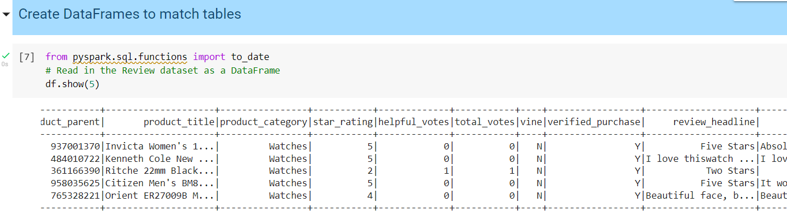
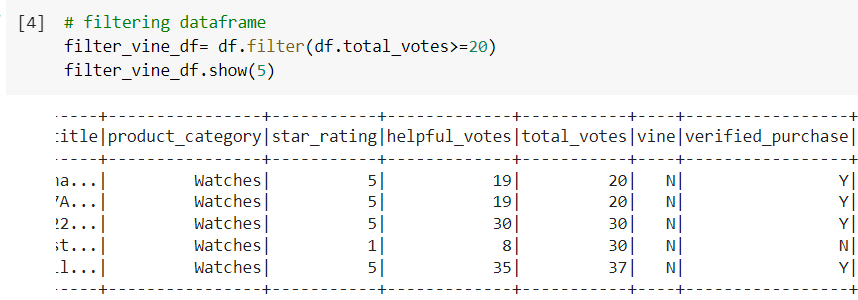
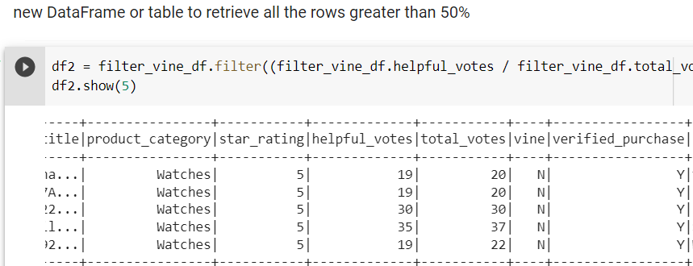
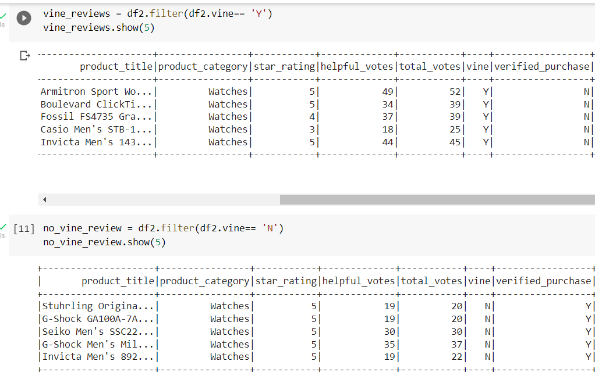
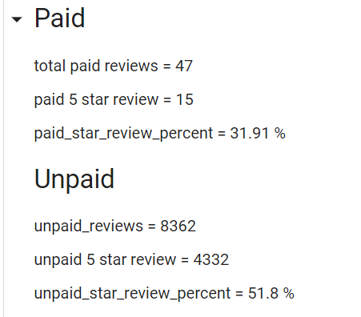
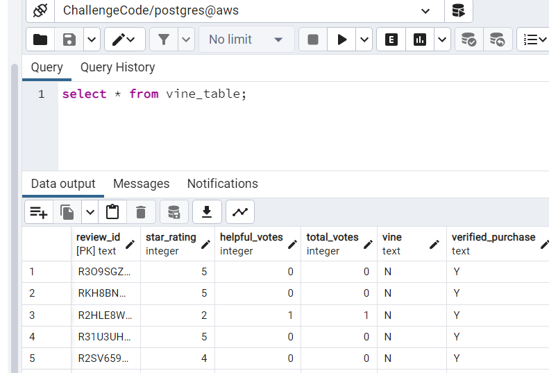
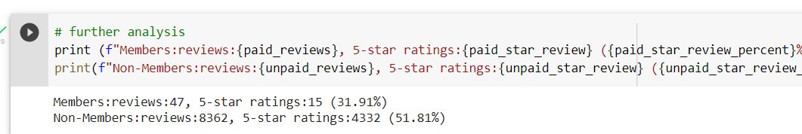

# Amazon_Vine_Analysis
## Overview of the analysis:
  In this analysis we had to analyze Amazon reviews written by members of the paid Amazon Vine program. We had to pick one of these datasets and use PySpark to perform the ETL process to extract the dataset, transform the data, connect to an AWS RDS instance, and load the transformed data into pgAdmin. We also used PySpark to determine any bias in dataset.For this whole process I used watch dataset to perform the analysis.
## Results: 
- The first process was to import watch dataset and then datframe was created asbelow.
 
- After grouping, we created four dataframes - customer, products, review and vine table.
- We also performed some analysis looking at watches which gott more than 20 votes and retrieved rows where number ofhelpful votes divided by total votes were greater than 50% and in figures below.

*How many Vine reviews and non-Vine reviews were there?*
- The analysis showed that buying watch from amazon was not popular as Vine reviews were= 47 and non-vine= 8362.

*How many Vine reviews were 5 stars? How many non-Vine reviews were 5 stars?*
- Vine reviews that were 5 star = 15 and non Vine reviews  = 4332

*What percentage of Vine reviews were 5 stars? What percentage of non-Vine reviews were 5 stars?*
- % of vine 5-star = 31.91%
  % of non-vine 5-star reviews = 51.8%
 

- here I would also like to add that the tables were successfuly added to postgres too, as seen in one of the outputs for vine review.

## Summary:
Positivity bias denotes a tendency for people to judge reality favorably.So if we look at the percentages of paid and unpaid reviews, the paid review would give us a false positivity rate thus creating a bias. This bias is also known as publication bias.
Thus, positivity bias may denote three phenomena: a tendency for people to report positive views of reality; a tendency to hold positive expectations, views, and a tendency to favor positive information in reasoning, as seen in the analysis for watches.
An *additional anaysis* can be done looking at mean for the ratings, which can give us an idea of the sale.
*Another additional anaysis* can be done by looking at reviews provided by members of amazon verses non-members, giving us further insight into the product, as seen in output below.
